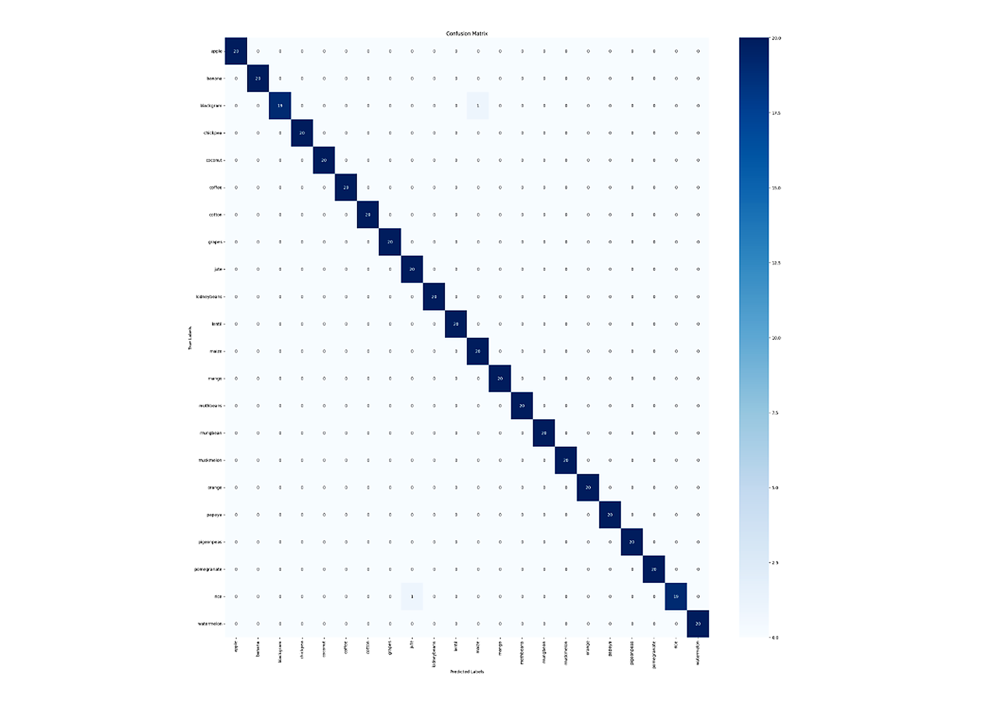
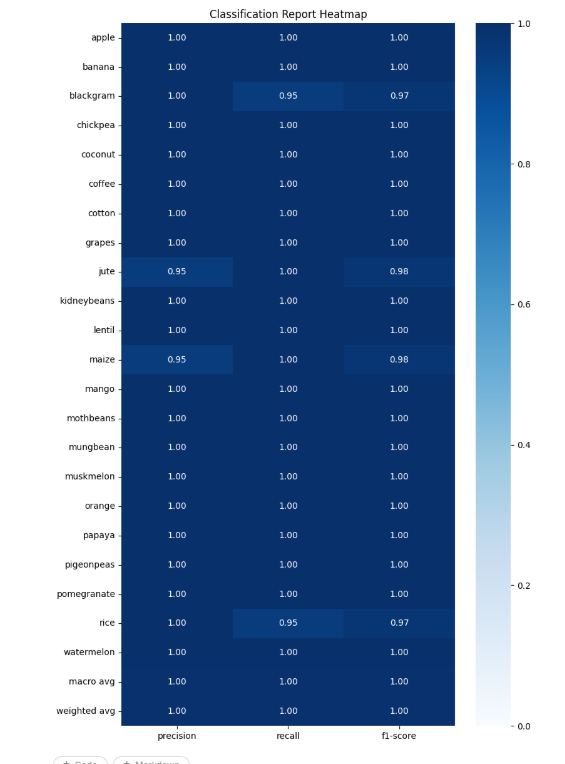
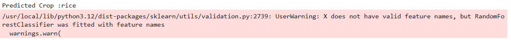
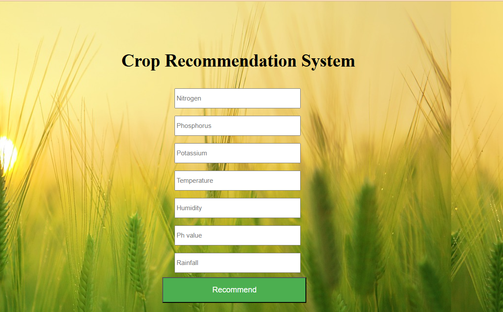
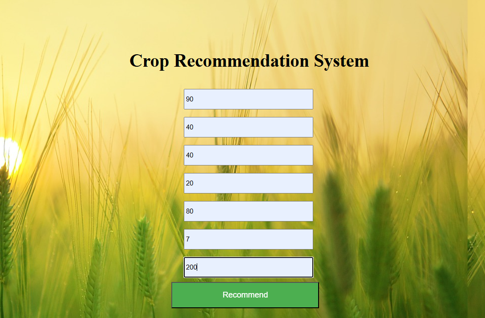
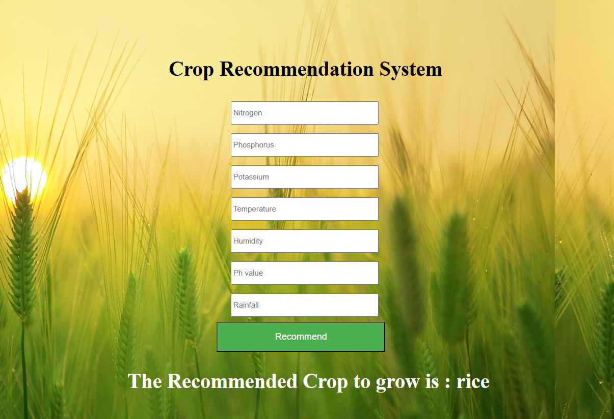

# 🌾Crop_Recommendation_System :-
- An end-to-end Machine Learning project that recommends the most suitable crop to cultivate based on soil nutrients (N, P, K), climatic conditions (temperature, humidity,rainfall), and soil pH.
- This will help farmers and agronomists to make data driven agricultural decisions.

## 📖 Table of Contents :-
- Overveiw
- Dataset
- Exploratory Data Analysis(EDA)
- Preprocessing and Feature Scaling
- Model Training
- Model Evaluation
- Visualization Graphs
- Model Serialization
- Model Prediction
- Flask Recommendation Web Application
- Project Structure
- Tech Stack
- How to run
- Future Improvements

## 📌 Overview :-
- This project uses [Crop Recommendation Dataset](https://www.kaggle.com/datasets/atharvaingle/crop-recommendation-dataset) to train a **RandomForestClassifier Model** that predicts the best crop to grow for a given set of soil and climate conditions.
- The pipeline contains model exploration, preprocessing, training, evaluation, visualization and is deployed using **Flask Web API** where user can input soil and climate conditions through a form and wil get instant recommendation.

## 📊 Dataset :-

| Detail | Value |
|--------|-------|
| Source | Crop Recommendation Dataset (Kaggle) |
| Rows | 2200 |
| Features | 7 → `N`, `P`, `K`, `temperature`, `humidity`, `ph`, `rainfall` |
| Target | `label` — 22 crop types (rice, maize, cotton, coffee, banana, etc.) |
| Missing Values | None |
| Duplicate Rows | None |

## 🔍 Exploratory Data Analysis (EDA) :-

- Verified dataset shape, column data types, and absence of null/duplicate values.
- Analyzed unique value counts and class-wise label distribution (`value_counts`).
- Computed group-wise feature means per crop label (`groupby("label").mean()`) to understand how nutrient/climate profiles differ across crops.

## ⚙️ Feature Engineering & Preprocessing :-

- Separated the dataset into **features (X)** and **target labels (y)**
- Applied **StandardScaler** to normalize all numerical features to a common scale
- Performed a **stratified 80-20 train-test split** to preserve class balance across all 22 crop types.

## 🤖 Model Training :-
I have trained a model using **RandomForestClassifier** which is present in **sklearn.ensemble library** with some tuned hyperparamters to balance accuracy,precision and to avoid overfitting.
- 1.n_estimators: 100
- 2.max_depth: 10
- 3.min_samples_split: 5
- 4.min_samples_leaf: 5
- 5.random_state: 42

## 📈 Model Evaluation
I have evaluated model using multiple weighted metrics on the held-out test set:
| Metric | Score |
|--------|-------|
| Training Accuracy | 99.66% |
| Testing Accuracy | 99.55% |
| Precision (weighted) | 99.57% |
| F1-Score (weighted) | 99.55% |
| Recall (weighted) | 99.55% |

## 📊 Visualization Graphs :-
Below graphs depicts Confusion Matrix and Classification Report of above trained model.
- **Graph1 : Confusion Matrix **
>

- **Graph2 : Classification Report **
>

## 💾 Model Serialization :-
- The trained model is saved along with its `StandardScaler` in a single  bundle to ensure correct preprocessing is applied at inference time.
- It also avoids the common bug of feeding unscaled raw input to a model is trained on sclaed data.
```python
bundle = {
    "model": model,
    "scaler": scaler,
    "features_cols": ['N','P','K','temperature','humidity','ph','rainfall'],
    "classes": model.classes_
}
```
## 🌱 Model Prediction :-
```python
import pickle as pkl
import pandas as pd

with open("Crop_Recommendation_RF.pkl", "rb") as f:
    bundle = pkl.load(f)

sample = pd.DataFrame([[90, 40, 40, 20, 80, 7, 200]], columns=bundle["features_cols"])
sample_scaled = bundle["scaler"].transform(sample)
predicted_crop = bundle["model"].predict(sample_scaled)

print(f"Predicted Crop: {predicted_crop[0]}")
```

---
>

## 🌐 Flask Recommendation Web Application :-
- The trained model bundle is served through a lightweight **Flask** app (`app.py`), allowing users to enter soil and climate values via a web form and get a
  real-time crop recommendation.
- This web application contains three as shown in graphs below.

**Graph1: Simple user form before user input :**
>

**Graph2: User Input form :**
>

**Graph3: Fianl Recommendation after user input :**
>

